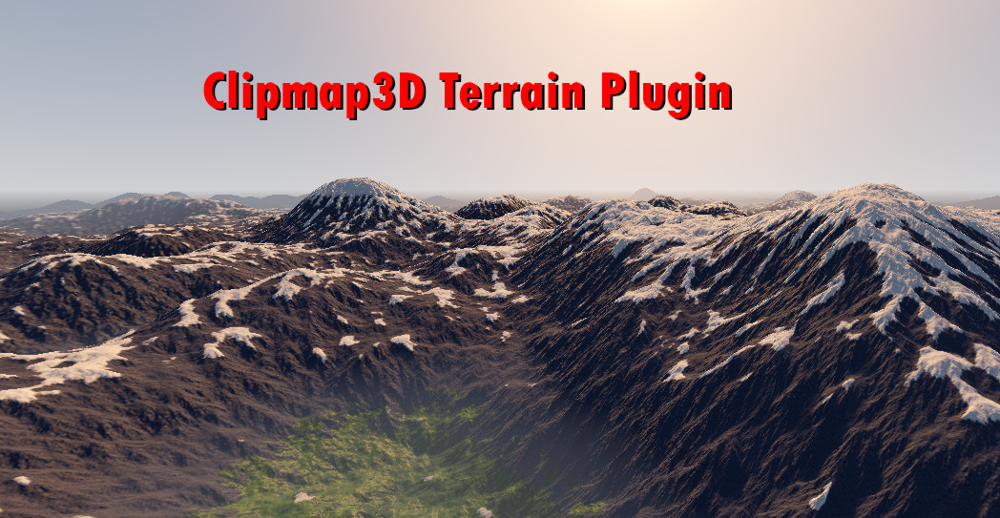

# Clipmap3D
A lightweight infinite procedural terrain system for Godot 4.6

## Overview
* Written in GDScript, GDShader, and GLSL
* Supports Forward+ and Mobile renderers
* Use a compute shader to generate and texture terrain on the GPU
* No manual work to author terrain; everything is done through code
* Over 30x30km render distance with configurable vertex density and levels of detail (LODs)
* Real-time toroidal LOD shifting as the player moves
* Supports blending up to 32 albedo + normal textures

## Roadmap
* Texture projection and stochastic sampling
* Floating-point origin shifting
* Foliage instancing (scatter system)
* Heightmap image imports and streaming

## Limitations
* This project is work-in-progress and is subject to major changes
* Physics interaction is primitive and limited to player collisions
* Image imports are not yet supported

## Trying the demos (4.6)
* This repository contains a demo folder with two example scenes
	* High-spec demo
	* Low-spec demo
* After loading a scene, set View -> Settings... -> View Z-Far to 16000
